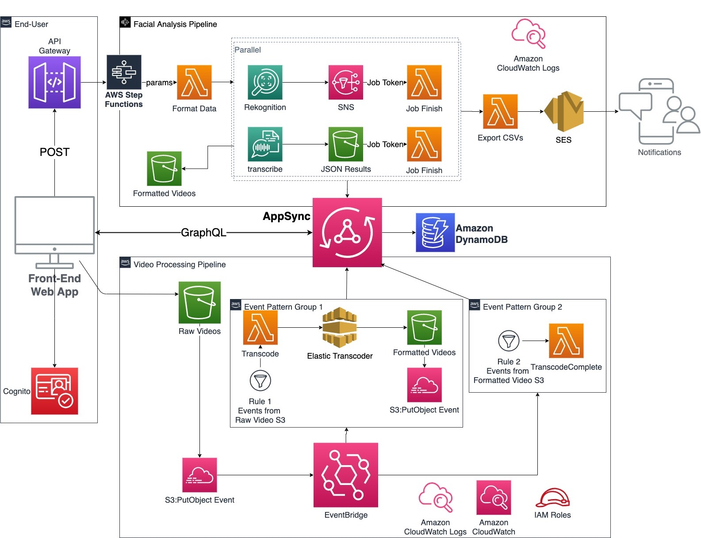

# Table of Contents

* [Build Once Deploy Many React](#build-once-deploy-many-react)
   * [The Scenario](#the-scenario)
   * [The Challenge](#the-challenge)
   * [The Solution](#the-solution)
      * [Pipeline Design](#pipeline-design)
      * [1. Prepare a config.js file](#1-prepare-a-configjs-file)
      * [2. Enable dynamic config loading at application runtime](#2-enable-dynamic-config-loading-at-application-runtime)
      * [3. How to access variables?](#3-how-to-access-variables)
      * [4. [CI] Build the code](#4-ci-build-the-code)
   * [Conclusion](#conclusion)


## High Level Requirements
FooAds is a global digital agency that engages with many Fortune 500 companies for a variety of digital advertising and has large amounts of ongoing interviews with clients, customers, and even people on the streets.

Currently, they have contracted at least 30+ officers and spend 4 million annually to manually filter out the critical words during the video interview and analyse people's emotions against what they say. 

Some examples are a BMW driver showing unhappiness when he talks about the appearance of his car, our loyal partner representative showing extremely happy about the engagement price.

However, spending 4 million on getting time-wasting results should be improved via technology, that's where we come up with an automated facial analysis solution to address this business problem.

## Implementations
The Data Services team will be responsible for:
1. Build the data formating lambda function and related services
2. Test the model accuracy based on previous manual results
3. Format the final result JSON

The Digital team will be responsible for:
1. Build the UI incrementally with feedback from the Data Services team
2. Ensure the data structure is aligned with the Integration team' design
3. API Gateway infra, DNS, CDN, and domain

The Integration team will be responsible for:
1. Design database schema
2. Implement EventBridge event-driven architecture
3. GraphQL real-time subscription to UI
4. Step function analysing pipeline

## High Level Solution Architecture


## Solution Components 
| No  | Logical Component   | Description                                                                                                                               |
|-----|---------------------|-------------------------------------------------------------------------------------------------------------------------------------------|
| 1   | Front-end Web App   | A Web-based User Interface that allows users to upload videos, monitor processing status in real time, and batch new tasks.               |
| 2   | API Gateway         | An API endpoint for POST request that triggers AWS StepFunction. Payloads includes selected JobIDs and user information.                  |
| 3   | Cognito             | User authentications for UI users. Unauthenticated users are not allowed, and authenticated users will have roles based on authorisation. |
| 4   | AWS StepFunction    | Forward parameters from API POST request to the data formatting Lambda function, followed by triggering a series of analysing tasks.      |
| 4.1 | Recognition         | AWS Recognition services that identify user emotion, results are returned via API.                                                        |
| 4.2 | SNS                 | An SNS topic subscribed to AWS Recognition and notify Lambda function that Recognition job is finished so to proceed.                     |
| 4.3 | Transcribe          | AWS Transcribe services that get the transcription from users and writes results to S3 bucket in JSON format.                             |
| 4.4 | Export CSV Lambda   | Format email content and send SES to users.                                                                                               |
| 5   | Raw Videos S3       | Store raw format video content.                                                                                                           |
| 6   | Formatted Videos S3 | Store formatted video content.                                                                                                            |
| 7   | Transcode Lambda    | Use Elastic Transcode services that transform raw videos to formatted videos.                                                             |
| 8   | EventBridge         | A centralised hub that controls which message trigging the relative services to achieve an event-drive architecture.                      |


## Project setup
This project's infra is written in AWS CDK, all codes are simplified and kept minimum for demo purposes.

#### 1. Install all dependecies

```
cd app && npm install
```

#### 2. Configure the profile for AWS CDK CLI

Create an programatic access role in the AWS account that I provided.
Place the profile with template below in `.aws/config`

```
[profile emotiondetective]
aws_default_region=ap-southeast-2
region=ap-southeast-2
aws_access_key_id=REPLACE_WITH_YOURS
aws_secret_access_key=REPLACE_WITH_YOURS
```

#### 3. Deploy stacks

See `package.json` of the pre-defined scripts. e.g.

```
npm run deploy:staging:site-resources
```

## ⚠ There are 3 manual actions involved to deploy.

95% the deployments are done by AWS CDK, which means a little manual configuration is needed if you want to deploy the whole stack in **a new or your own AWS account**.

- Cloud Trail: Add a trail for both raw/formatted S3 bucket. So Eventbridge will pick up the events.
- Transcode Pipeline: You will need to create a default one.
- Pay attention to AppSync API Key expiration. By default it's 7 days.
