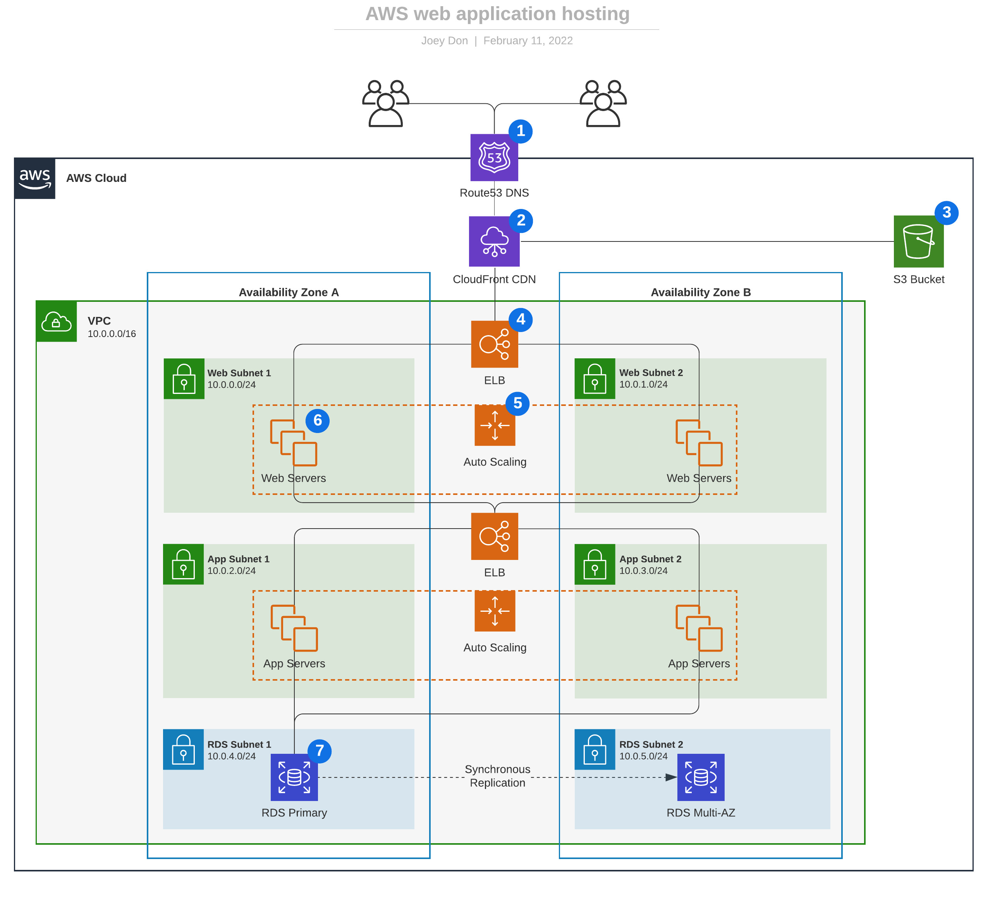

# Table of Contents

* [3 Tier Web App](#table-of-contents)
   * [High Level Requirements](#high-level-requirements)
   * [High Level Solution Architecture](#high-level-solution-architecture)
   * [Solution Components](#solution-components)

## High Level Requirements
Foo Online Shop is a global SaaS company that offers transcription services. They've decided to use it's own Web servers and own app servers running a bunch of .Net services - both on Windows Servers. Currently, both of Web Servers and App Servers are running on-premises. However, as the rapid growth, without leveraging cloud technology it becomes hard and almost impossible to increase the Server size dynamically with unpredictable traffics, while the mission criticle services have to meet high availability.

Thus, in this solution not only we are planning to fully migrate on AWS with minimum changes on how they separated web and app servers, but also need to take scalability into consideration. 

That's why I've designed this solution - a three-tier architecture which is a software architecture pattern where the application is broken down into three logical tiers: the presentation layer, the business logic layer and the data storage layer. Each of these layers or tiers does a specific task and can be managed independently of each other. This a shift from the monolithic way of building an application where the frontend, the backend and the database are both sitting in one place.

## High Level Solution Architecture

## Solution Components 
| No | Logical Component   | Description                                                                                                                                                                                                                |
|----|---------------------|----------------------------------------------------------------------------------------------------------------------------------------------------------------------------------------------------------------------------|
| 1  | Route 53 DNS        | The user’s DNS requests are served by Amazon Route 53, a highly available Domain Name System (DNS) service.                                                                                                                |
| 2  | CDN                 | Static, streaming, and dynamic content is delivered by Amazon CloudFront, a content delivery network (CDN).                                                                                                                |
| 3  | S3                  | Resources and static content used by the web application are stored on Amazon Simple Storage Service (S3).                                                                                                                 |
| 4  | ELB                 | HTTP requests are first handled by Elastic Load Balancing (ELB), which automatically distributes incoming application traffic among multiple Amazon Elastic Compute Cloud (EC2) instances across Availability Zones (AZs). |
| 5  | Auto Scaling Group  | Web servers and application servers are deployed in Auto-Scaling groups which automatically adjust capacity up or down according to conditions you define.                                                                 |
| 6  | Web and App Servers | Web servers and application servers are deployed on Amazon EC2 instances.                                                                                                                                                  |
| 7  | RDS                 | To provide high availability, the relational database that contains application’s data is hosted redundantly on a Multiple Availabilty Zone (Multi-AZ) deployment of Amazon Relational Database Service (Amazon RDS).      |
